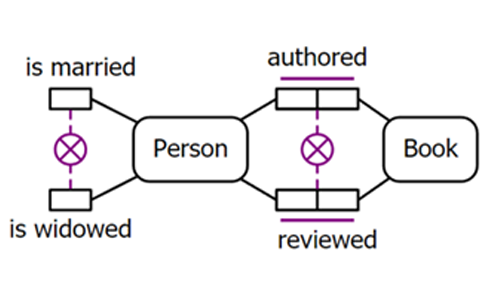

# ORM w pigułce
- Narzędzie mające na celu upraszczać modelowanie baz danych
- W założeniu przeznaczone dla osób nietechnicznych
- Bardziej skomplikowane od problemu który rozwiązuje
- Łatwe do zrozumienia po przeczytaniu przystępnie napisanej 200-stronicowej książki
- Zerowe wsparcie (brak narzędzi, materiałów, dokumentacji)
- Zerowa popularność
- Wszystko i wszyscy mylą to z `Object-Relational Mapping`

## Podstawy ORM

- **Instancja**
    - Podobne do konceptu instacji w programowaniu obiektowym
    - np. ***Janek*** jest instancją encji ***Student***
    - np. ***12*** jest instancją encji ***Wiek***

- **Typy obiektów**
    - **Encja** 
        - np. `Person`, `Car`, `Country`
        - Podobna koncepcyjnie do klasy w programowaniu obiektowym

        

    - **Wartość** 
        - np. `Name`, `Number`, `Date`
        - Może być przypisana do tylko jednej encji
    
        

- **Rola**
    - Jest przedstawiana przez pojedyńczy prostokącik będący częścią `predyktatu`
    - np. `Predykat` ***Uczeń ma Wiek*** zawiera dwie `role`
        - `Rolę` **posiadacza** która jest pełniona przez `encję` **Uczeń**
        - `Rolę` **posiadanego** która jest pełniona przez `encję` **Wiek**
    - np. `Predykat` ***Osoba prowadzi Samochód*** zawiera dwie `role`
        - `Rolę` **kierującego pojazdem** która jest pełniona przez `encję` **Osoba**
        - `Rolę` **pojazdu** która jest pełniona przez `encję` **Samochód**

    - `Instancja roli` powstaje, dopiero gdy konkretna `instancja encji lub wartości` uczestniczy w konkretnej `instancji predykatu`
        - np. w fakcie: ***Adam prowadzi Toyotę Yaris***
            - **Adam** jest `instancją encji` **Osoba**
            - **Adam** jest `instancją roli` **kierowcy pojazdu**
            - **Toyota Yaris** jest `instancją encji` **Samochód**
            - **Toyota Yaris** jest `instancją roli` **pojazd**

- **Predyktat**
    - `Predykat` to wyrażenie opisujące relacje między encjami
    - np. ***Osoba jest_palaczem*** to `predyktat` z **jedną** `rolą`
    - np. ***Osoba posiada Samochód*** to `predyktat` z **dwiema** `rolami`
    - np. ***Student zapisany na Kurs w Semestrze*** to `predyktat` z **N**-ilością `ról`

    \
    *Reprezentacja graficzna predyktatu*

    \
    *Reprezentacja graficzna predyktatu z nazwą predykatu*\

- **Relacja**
    - Jest to **instancja** `predyktatu` zachodząca pomiędzy dwiema **instancjami** `obiektu` *(obiekt to encja lub wartość)*
    - np. jeśli **Jan posiada Forda**, to jest to `relacja` między **Janem** *(instancja np. Osoby)* a **Fordem** *(instancja np. Auta)*

- **Identyfikatory**
    - Specjalny rodzaj wartości
    - Służy do odróżniania jednej instancji od innych w ramach tego samego typu obiektu
    - Jednoznacznie identyfikuje daną instancję obiektu
    - np. ***Osoba*** *identyfikowana przez* ***PESEL***

- **Skrót notacji dla identyfikatorów**
    - Parę `wartość` i `encja`, połączoną predyktatem, można zastąpić samą `encją`\
        

    - **Gdy typ identyfikatora nie jest specificzny dla danej encji:**
        - np. **nazwę** może mieć wiele różnych encji *(nazwa produktu, nazwa kursu, nazwa lokalizacji)*
        - Na symbolu encji skrótowej, nazwa identyfikatora jest poprzedzona kropką *(eg. [Simple mandatory role constraint](./official_glossary.pdf))*
        - Nazwa wartości powstaje przez złączenie nazwy encji i nazwy identyfikatora
            - np. gdy skrótowa encja ma postać: **Produkt (.Nazwa)** to nazwa wartości to **ProduktNazwa**
            - np. gdy skrótowa encja ma postać: **Kurs (.Nazwa)** to nazwa wartości to **KursNazwa**
            - np. gdy skrótowa encja ma postać: **Lokalizacja (.Nazwa)** to nazwa wartości to **LokalizacjaNazwa**

    - **Gdy wartość to jednostka**
        - np. jednostki układu SI, pieniężne, itp.
        - Na symbolu encji skrótowej, nazwa identyfikatora jest zakończona dwukropkiem
        - Nazwa wartości powstaje przez złączenie skrótu jednostki i nazwy
            - np. gdy skrótowa encja ma postać: **Produkt (kg:)** to nazwa wartości to **kgValue**
            - np. gdy skrótowa encja ma postać: **Kurs (PLN:)** to nazwa wartości to **PLNValue**
            - np. gdy skrótowa encja ma postać: **Lokalizacja (km:)** to nazwa wartości to **kmValue**
        - Można dodać informację o typie jednostki
            - np. `Produkt (kg:Masa)`, `Kurs (PLN:Pieniądze)`, `Lokalizacja (km:Długość)`, itp.

    - **Gdy typ identyfikatora jest specyficzny dla danej encji**
        - np. tylko **książki** mają **ISBN**
        - Nazwa wartości jest taka sama jak nazwa identyfikatora
            - np. gdy skrótowa encja ma postać: Książka (ISBN) to nazwa wartości to ISBN
            - np. gdy skrótowa encja ma postać: Student (NrIndexu) to nazwa wartości to NrIndexu

- **Ograniczenie unikatowości**
    - Jest przedstawione jako linią nad jedną lub wieloma rolami
    - Mówi że dana `instancja roli` lub kombinacja `instancji ról` może wystąpić jedynie raz
        - np. nie mogą istnieć dwa produkty o tej samej nazwie
        - np. nie może być dwóch studentów identyfikowanych tym samym numerem indexu na danym kursie

- **Ograniczenie obowiązkowości**:
    - Określa czy dana encja musi pełnić daną roli
        - np. każdy **Pracownik** ma **PracownikID**
    - Brak symbolu oznaczna brak wymogu udziału w danej roli
    - Wymóg udziału w danej roli oznaczany jest symbolem kropki ustawionej na lini łączącej encję z rolą

- **Ograniczenie ilości**:
    - Określa ile razy instancja danej encji może odegrać daną rolę
        - np. **Zamówienie** ma przynajmniej jeden **Produkt**
        - np. **Drużyna** ma dokładnie 5 **Graczy**

- **Ogranicznie wartości**:
    - Określa jakie wartości mogą przyjmować instancje obiektów typu wartość
        - np. **Wiek** musi być w zakresie od 0 do 120
        - np. **Płeć** to jedno z M, F, lub O

- **Ograniczenia zbiorów**:
    - Określa relację pomiędzy populacjami ról lub populacjami obiektów
        - np. Każdy **Kierowca** to **Pracownik**
        - np. **Osoba** nie może być jednocześnie **Uczniem** i **Nauczycielem**
        - np. **Uczeń** jest **Ubezpieczony**

## Symbole w ORM

------

Obiekt typu encja

------

Obiekt typu wartość

------

|                                      |                                                                         |
|--------------------------------------|-------------------------------------------------------------------------|
| Pojedyńczy prostokącik               | Rola                                                                    |
| Grupa dwóch lub więcej prostokącików | Predyktat                                                               |
| Tekst                                | Nazwa predyktatu                                                        |
| Czarny trójkącik                     | Wskazuje kierunek czytania *(używany jeżeli jest inny niż standardowy)* |

------

Określenie że dana encja musi brać udział w danej roli:
- Każda osoba jest urodzona w jakimś kraju

------

**Pojedyńcza linia**\
Określenie że każda instancja danej roli może brać udział w tym fakcie tylko raz:
- Każda osoba ma tylko jedną płeć, ale wiele osób może mieć tą samą płeć
- Każda osoba ma tylko jeden kraj urodzenia, ale wiele osób może być urodzonym w tym samym kraju
- Każda osoba może być prezydentem tylko jednego kraju, a każdy kraj może mieć tylko jednego prezydenta

 

**Ciągła linia nad wieloma rolami**\
Określenie że każda grupa instancji danych ról może brać udział w tym fakcie tylko raz:
- Każda osoba może mówić w wielu językach, jednak taka para jest unikatowa

------

**Podwójna pojedyńcza linia**\
TODO
- TODO

------

**Ciągła linia nad częścią z ról**\
Określenie że każda grupa instancji danych ról może brać udział w tym fakcie tylko raz:
- Dana drużyna może brać udział tylko raz w danym konkursie
- Dane miejsce może być tylko raz zdobyte w danym konkursie

------

Nazwa roli:
- Pracodawca zatrudnia pracownika

------

Określenie że populacje dwóch ról są sobie równe:
- W każdym przypadku, gdy u Pacjenta wykonano pomiar ciśnienia skurczowego, ten sam Pacjent musi również mieć wykonany pomiar ciśnienia rozkurczowego i odwrotnie

------

Określenie że dana encja nie może brać udziału w obu rolach na raz:
- Osoba nie może być jednocześnie wdową i zamężna
- Autor nie może być recenzentem własnej książki

------

Określenie że dana encja musi brać udział w minimum jednej z ról
- Gość musi mieć paszport lub prawo jazdy lub oba

------

Określenie że populacja danej roli jest podzbiorem populacji innej roli lub są one równe:
- Populacja osób palących zawiera się w populacji osób z wyższym ryzykiem zachorowania na raka
- Każa osoba która dostała ocenę z kursu jest na niego zapisana

------

Określenie że suma populacji dwóch ról jest podzbiorem populacji innej roli lub są one równe:
- Jeśli doradca pełni służbę w danym kraju, musi posługiwać się językiem, który jest często używany w tym kraju

------

Określenie zewnętrznej unikatowości

------

Określenie rodzaju nierówności pomiędzy wartościami dwóch ról:
- Data końca projektu jest w dniu rozpoczęcia projektu lub po nim

------

Określenie jakie wartości może przyjmować obiekt:
- Wiek to liczba w zakresie od zera do nieskończoności dodatniej
- Ocena to litera od A do F
- Ocena to liczba w zakresie od 1 do 7
- Ocena pozytywna to liczba w zakresie od 50 do 100
- Ujemna temperatura do liczba większa bądz równa -273.15 i mniejsza od 0
- Płeć to albo M albo F

------

Określenie jakie wartości może przyjmować relacja.

------

Określenie ile raz dana encja może uczestniczyć w danej roli:
- Ekspert to osoba która
    - brała udział w od 4 do 7 paneli
    - jest recenzentem minmum 5 prac
    - każda liczona praca musi być zrecenzowana przez minimum 2 ekspertów
- Dana osoba ma być jurorem 12 razy

------

Określenie ile raz dana kombinacja roli może mieć miejsce:
- Student może zapisać się na maksymalnie dwa kursy

------

Określenie że dana encja jest podtypem drugiej:
- Wykładowca jest pracownikiem, a pracownik jest człowiekiem
- Student jest człowiekiem
- Student-pracownik jest jednocześnie studentem i pracownikiem

------

Ograniczenie podtypów:
- Zwierzę nie może być jednocześnie psem i kotem
- Każdy członek zespołu musi być albo graczem albo trenerem
- Każda osoba jest albo kobietą albo mężczyzną
